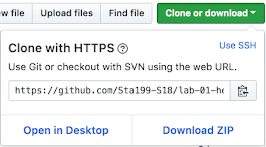

**Note**: Be sure to push your work to GitHub at least once before 5pm tomorrow to get credit for this application exercise.

# Getting started

- Go to our class's GitHub organization [sta-679-s22](https://github.com/sta-679-s22)
- Find the GitHub repository (which we'll refer to as "repo" going forward) for this lab, `appex-04-potential-outcomes-YOUR-GITHUB-HANDLE`. This repo contains a template you can build on to complete your assignment.

```{r clone-repo-link, fig.margin = TRUE, echo = FALSE, fig.width=3}

```

- On GitHub, click on the green **Clone or download** button, select **Use HTTPS** (this might already be selected by default, and if it is, you'll see the text **Clone with HTTPS** as in the image below). Click on the clipboard icon to copy the repo URL.

```{r new-project-from-gh, fig.margin = TRUE, echo = FALSE, fig.width=3}
knitr::include_graphics("img/01/new-project-from-gh.png")
```

- Go to RStudio Click File > New Project > Version Control > Git. In "Repository URL", paste the URL of your GitHub repository. It will be something like `https://github.com/LucyMcGowan/myrepo.git`.

# Packages

In this lab we will work with one package: `tidyverse` which is a collection of packages for doing data analysis in a "tidy" way. This should already been installed from your tech setup. 

If you'd like to run your code in the Console as well you'll also need to load the package there. To do so, run the following in the console. 

```{r eval = TRUE, message = FALSE, warning = FALSE}
library(tidyverse) 
```

Note that the package is also loaded with the same commands in your R Markdown document.

Welcome to Lucy Land, a land where I have special powers so I can see all potential outcomes `r emo::ji("sunglasses")`. I will share those powers with you! We're going to turn my code to generate meeple into a function! Here we are generating a population that has a causal effect of *2*. Copy this code into your RMarkdown document. Knit, Commit, and Push!

```{r}
## Generate lucy land's meeple

make_meeple <- function(n = 50) {
  tibble(
    y0 = rnorm(n, 1),
    y1 = y0 + 2
  )
}
set.seed(1)

make_meeple()
```

1. We are interested in conducting a randomized experiment on these meeple. The code below will generate 50 meeple and randomize them to either the exposed or unexposed group. Update the code to run the same experiment on 100 meeple.  Create a new variable, `y_obs`. Calculate the average treatment effect. Knit Commit and Push!

```{r, eval = FALSE}
proportion_exposed <- 0.5

d_random <- make_meeple(n = 50) %>%
  mutate(x = sample(rep(c(0, 1), times = c(50 * (1 - proportion_exposed), 50 * proportion_exposed)),
         y_obs = _____) 

d_random %>%
  summarise(mean(y_obs[x == 1]) - mean(y_obs[x == 0]))
```

2. Using similar code as above, change your exposure proportion to 25% from 50%. Does this change whether your estimate is biased? Why or why not? Knit commit and push!

3. Run the code below. What does it show you? Knit commit and push!

```{r, eval = FALSE}

get_average_effect <- function(n, proportion_exposed = 0.5) {
  d_random <- make_meeple(n) %>%
    mutate(x = sample(rep(c(0, 1), times = c(n * (1 - proportion_exposed),
                                             n * proportion_exposed))),
           y_obs = ifelse(x == 1, y1, y0)) 
  
  d_random %>%
    summarise(mean(y_obs[x == 1]) - mean(y_obs[x == 0])) %>% 
    pull()
}

d <- tibble(
  n = seq(10, 10000, by = 10),
  tau_hat = map_dbl(n, get_average_effect)
)
ggplot(d, aes(n, tau_hat)) +
  geom_line() + 
  geom_point()
```

